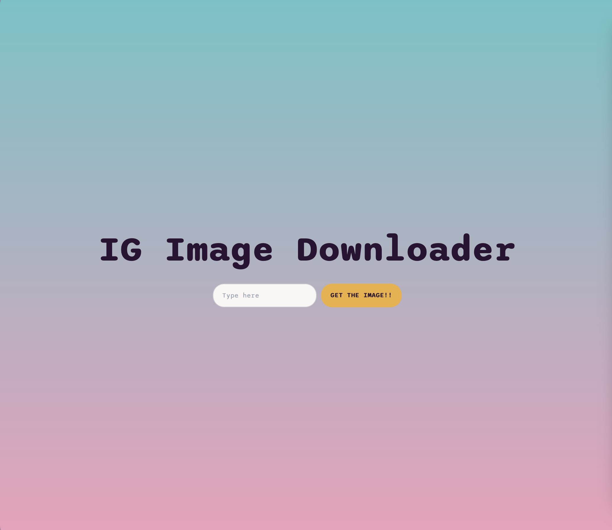
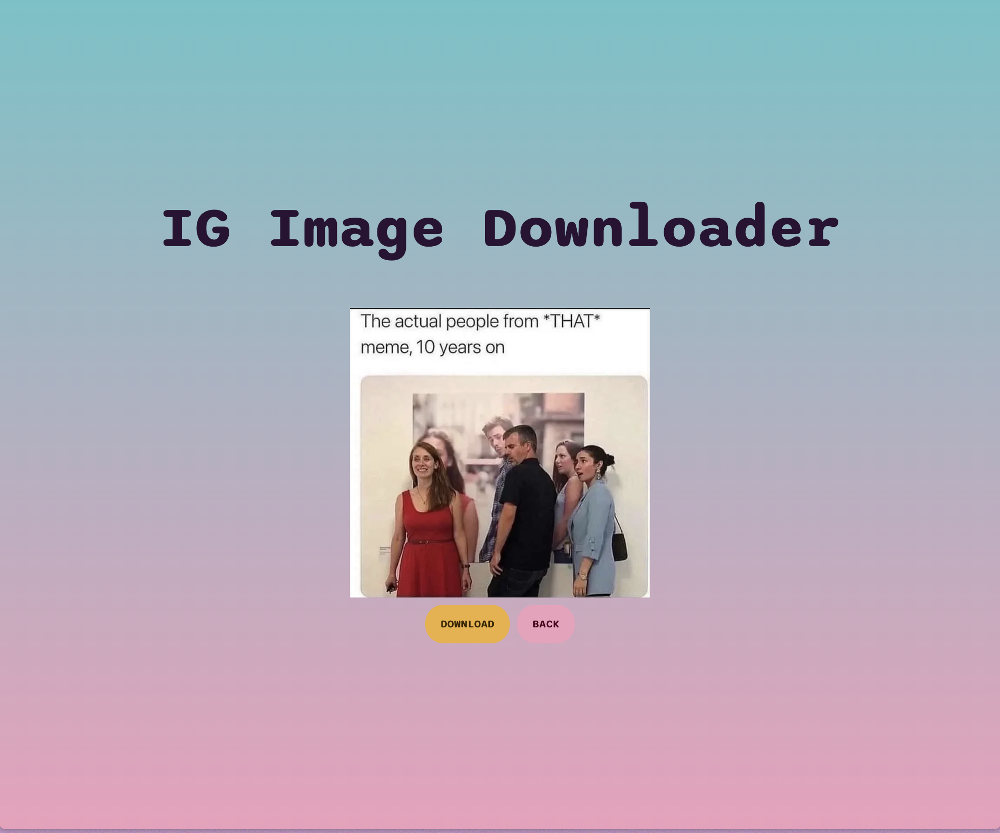

# Instagram Image Downloader

An IG Image Downloader made with daisyUI and Nextjs.

## Live Demo

[Here](https://instagram-image-downloader-vert.vercel.app/)

## Screenshots




## Tech Stack

- [Next.js](https://nextjs.org)
- [Tailwind CSS](https://tailwindcss.com)
- [tRPC](https://trpc.io)
- [daisyUI](https://daisyui.com/)

## Features

- Instagram Image Download

## Getting Started

### Prerequisites

- node >=18.12.1
- pnpm 1.22.19

### Installation

```bash
# Clone the repo
git clone https://github.com/ericsen-tsai/instagram-image-downloader.git

# Navigate into the project directory
cd instagram-image-downloader

# Install dependencies
yarn

# Start the development server
yarn dev
```

### Build

```bash
# Build the project
yarn build
```

### Deployment

This project is continuously deployed on [Vercel](https://vercel.com/).

## Contact

For more information or for any queries, feel free to reach out to me:

- [LinkedIn](https://www.linkedin.com/in/ericsen-tsai-a00948236/)
- [GitHub](https://github.com/ericsen-tsai)
- [GitLab](https://gitlab.com/ericsentsai)
- Email: <bommer95175@gmail.com>
